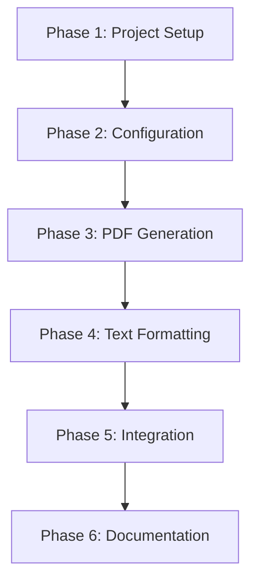

# Airtable to PDF Converter - Implementation Plan

## Overview
This document outlines the complete implementation plan for the Airtable to PDF converter project, including development phases, testing criteria, and success metrics.

## Phase 1: Project Setup and Basic Infrastructure
### Implementation Steps
1. Create project directory structure
2. Set up virtual environment
3. Create initial `requirements.txt` with core dependencies:
   - pyairtable
   - reportlab (for PDF generation)
   - python-dotenv (for configuration management)

### Testing Criteria
1. Directory Structure Verification:
```bash
# Run this command to verify structure
ls -R fragments2pdf/
```
Expected output should show all required directories and files.

2. Virtual Environment Verification:
```bash
# Verify Python version
python --version  # Should be 3.7+

# Check installed packages
pip list
```
Should show all required packages from requirements.txt.

## Phase 2: Configuration and Airtable Integration
### Implementation Steps
1. Implement `config.py`:
   - Airtable API key configuration
   - Table ID and base ID settings
   - Output directory settings
   - Page size constants (A5: 148 × 210 mm)
   - Font settings and sizes

2. Develop `airtable_client.py`:
   - Airtable API connection class
   - Methods to fetch records
   - Data validation and error handling
   - Field mapping for required data

### Testing Criteria
1. Configuration Loading:
```python
# Test config.py
from config import Config

# Should load without errors
config = Config()

# Verify all required settings are present
assert config.airtable_api_key is not None
assert config.table_id is not None
assert config.base_id is not None
```

2. Airtable Connection:
```python
# Test airtable_client.py
from airtable_client import AirtableClient

client = AirtableClient()
records = client.get_records()

# Verify data structure
assert len(records) > 0
for record in records:
    assert 'Title' in record
    assert 'Sequence' in record
    assert 'Attribute1' in record
    assert 'Content' in record
```

## Phase 3: PDF Generation Core
### Implementation Steps
1. Create `pdf_generator.py`:
   - PDF document class with A5 page size
   - Page layout manager
   - Basic text placement functions
   - Font management for Latin and Cyrillic characters

2. Implement page layout components:
   - Title placement (top-left)
   - Sequence number placement (top-right)
   - Attribute list placement (right margin)
   - Content area definition
   - Comment count placement (bottom-right)

### Testing Criteria
1. PDF Creation:
```python
# Test pdf_generator.py
from pdf_generator import PDFGenerator

generator = PDFGenerator()
pdf = generator.create_pdf()

# Verify PDF properties
assert pdf.page_size == (148, 210)  # A5 size in mm
assert pdf.page_count > 0
```

2. Layout Verification:
```python
# Test page layout
page = generator.create_page()

# Check element positions
assert page.title_position == (10, 200)  # Top-left
assert page.sequence_position == (130, 200)  # Top-right
assert page.content_area == (10, 180, 130, 20)  # Main content area
```

## Phase 4: Text Formatting and Processing
### Implementation Steps
1. Develop `text_formatter.py`:
   - Text formatting parser
   - Support for:
     - Line breaks
     - Bold text
     - Underlined text
     - Italic text
     - Colored text
   - Cyrillic character handling

2. Implement content truncation:
   - Text measurement functions
   - Truncation algorithm
   - Ellipsis addition
   - Truncation counter

### Testing Criteria
1. Formatting Preservation:
```python
# Test text_formatter.py
from text_formatter import TextFormatter

formatter = TextFormatter()
test_text = "**Bold** _Italic_ __Underline__"

# Verify formatting
formatted_text = formatter.process(test_text)
assert "Bold" in formatted_text.get_bold_elements()
assert "Italic" in formatted_text.get_italic_elements()
```

2. Truncation Testing:
```python
# Test content truncation
long_text = "Very long text..." * 100
truncated = formatter.truncate(long_text, max_length=1000)

assert len(truncated) <= 1000
assert truncated.endswith("...")
```

## Phase 5: Integration and Testing
### Implementation Steps
1. Create `main.py`:
   - Command-line interface
   - Process flow coordination
   - Error handling
   - Progress reporting

2. Testing scenarios:
   - Basic record generation
   - Long content truncation
   - Special character handling
   - Formatting preservation
   - Error cases

### Testing Criteria
1. End-to-End Test:
```python
# Test main.py
from main import process_airtable_to_pdf

# Run complete process
result = process_airtable_to_pdf()

# Verify output
assert result.success
assert result.pdf_path.exists()
assert result.record_count > 0
```

2. Error Handling:
```python
# Test error scenarios
# 1. Invalid API key
# 2. Network failure
# 3. Invalid data format
# 4. PDF generation failure

# Each should be caught and handled gracefully
```

## Phase 6: Documentation and Refinement
### Implementation Steps
1. Create README.md with:
   - Installation instructions
   - Configuration guide
   - Usage examples
   - Troubleshooting section

2. Code cleanup and optimization:
   - Performance review
   - Code style consistency
   - Error handling improvements
   - Logging implementation

### Testing Criteria
1. Documentation Verification:
```bash
# Check README.md exists and is complete
cat README.md

# Verify all sections are present:
# - Installation
# - Configuration
# - Usage
# - Troubleshooting
```

2. Code Quality:
```bash
# Run linting
flake8 fragments2pdf/

# Run type checking
mypy fragments2pdf/

# Run test coverage
pytest --cov=fragments2pdf/
```

## Automated Testing Setup
### Directory Structure
```
fragments2pdf/
├── tests/
│   ├── __init__.py
│   ├── test_config.py
│   ├── test_airtable_client.py
│   ├── test_pdf_generator.py
│   ├── test_text_formatter.py
│   └── test_integration.py
```

### Test File Contents
Each test file should contain:
1. Unit tests for individual components
2. Integration tests for component interaction
3. Edge case handling
4. Error scenario testing

## Continuous Testing
### Setup Requirements
1. Test runner (pytest)
2. CI/CD pipeline
3. Pre-commit hooks for:
   - Code formatting
   - Linting
   - Basic tests

## Success Criteria
1. Successfully connects to Airtable and retrieves data
2. Generates PDF with correct A5 page size
3. Maintains all required text formatting
4. Properly handles Cyrillic characters
5. Implements content truncation when needed
6. Places all elements in correct positions
7. Handles errors gracefully
8. Provides clear documentation

## Implementation Dependencies
