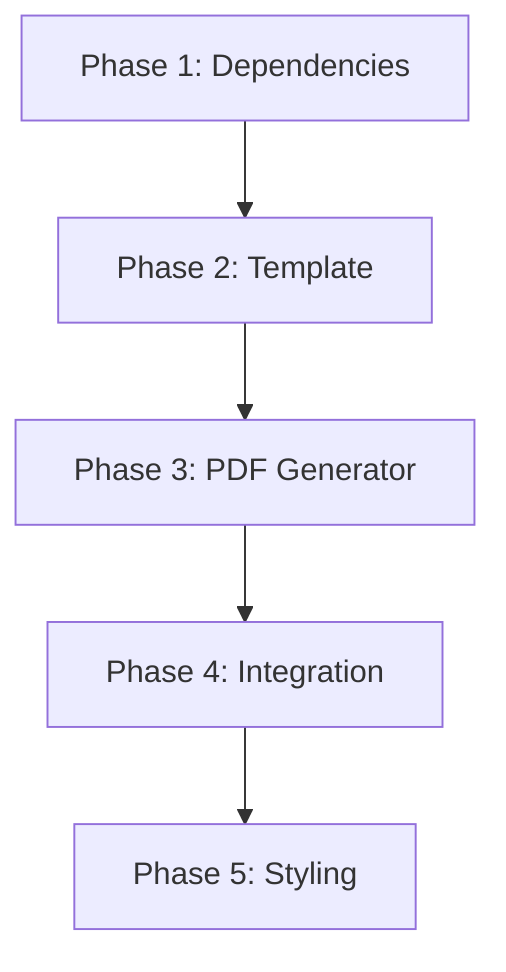

# HTML to PDF Conversion Implementation Plan

## Overview
This document outlines the implementation plan for converting Airtable data to PDF using a single Jinja2 template with embedded CSS. This approach provides better portability and simpler maintenance.

## Phase 1: Dependencies Update
### Implementation Steps
1. Update `requirements.txt` with new dependencies:
   - jinja2 (for HTML templating)
   - xhtml2pdf (for PDF generation)
   - pdfminer.six (for PDF content verification)

### Testing Criteria
1. Verify new dependencies installation:
```bash
pip install -r requirements.txt
pip list | grep -E "jinja2|xhtml2pdf|pdfminer"
```

## Phase 2: Template Implementation
### Implementation Steps
1. Create `fragment.html.j2` template:
   - HTML5 structure with embedded CSS
   - Meta tags for proper encoding
   - A5 page size definition
   - Layout and typography styles
   - Dynamic content areas

2. Template structure:
   ```html
   <!DOCTYPE html>
   <html>
   <head>
       <meta charset="UTF-8">
       <style>
           @page {
               size: 148mm 210mm;  /* A5 size */
               margin: 10mm;
           }
           /* Embedded CSS styles */
       </style>
   </head>
   <body>
       <!-- Template content -->
   </body>
   </html>
   ```

3. Implement template features:
   - Title placement (top-left)
   - Sequence number (top-right)
   - Attribute list (right margin)
   - Content area
   - Comment count (bottom-right)
   - Page breaks
   - Cyrillic support

### Testing Criteria
1. Template rendering test:
```python
from jinja2 import Environment, FileSystemLoader
env = Environment(loader=FileSystemLoader('.'))
template = env.get_template('fragment.html.j2')
html = template.render(sample_data)
assert 'sample_data' in html
```

## Phase 3: PDF Generator Implementation
### Implementation Steps
1. Create `pdf_generator.py`:
   - Template loading and rendering
   - HTML to PDF conversion
   - Page size and orientation handling
   - Error handling and logging

2. Add support for:
   - Cyrillic characters
   - Custom fonts
   - Page numbering
   - Headers and footers

### Testing Criteria
1. PDF generation test:
```python
generator = PDFGenerator()
pdf = generator.generate_pdf(sample_data)
assert pdf.exists()
assert pdf.stat().st_size > 0
```

2. Content verification:
```python
# Verify PDF content
from pdfminer.high_level import extract_text
text = extract_text(pdf_path)
assert sample_data['title'] in text
```

## Phase 4: Integration
### Implementation Steps
1. Update `main.py`:
   - Template file configuration
   - PDF output configuration
   - Progress reporting
   - Error handling

2. Add command-line options:
   - Output directory
   - Template customization
   - Debug mode

### Testing Criteria
1. End-to-end test:
```python
from main import process_airtable_to_pdf
result = process_airtable_to_pdf()
assert result.success
assert result.pdf_path.exists()
```

## Phase 5: Styling and Polish
### Implementation Steps
1. Implement responsive design:
   - A5 page size
   - Proper margins
   - Text flow
   - Page breaks

2. Add styling features:
   - Custom fonts
   - Color schemes
   - Typography
   - Spacing

3. Optimize for print:
   - Page breaks
   - Margins
   - Headers/footers
   - Page numbers

### Testing Criteria
1. Style verification:
```python
# Test style application
styles = generator.get_applied_styles()
assert 'font-family' in styles
assert 'page-size' in styles
```

## Success Criteria
1. Successfully generates PDF from HTML template
2. Maintains all required text formatting
3. Properly handles Cyrillic characters
4. Implements content truncation when needed
5. Places all elements in correct positions
6. Handles errors gracefully
7. Provides clear documentation

## Implementation Dependencies


## Required Dependencies
```
jinja2==3.1.3
xhtml2pdf==0.2.13
pdfminer.six==20231228
```

## Directory Structure
```
fragments2pdf/
├── fragment.html.j2    # Single template file with embedded CSS
├── pdf_generator.py
├── main.py
├── config.py
├── airtable_client.py
└── requirements.txt
``` 